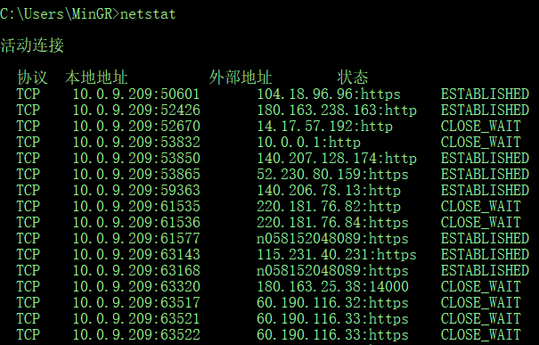
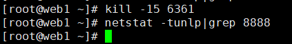
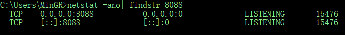

# 前言
在 `windows` 系统做开发，在启动某个服务时经常会有出现 <u>该端口已被暂用</u> 的提示信息。

笔者开始时有点奇怪，比如使用 `tomcat` 做容器时，在 `Idea` 下就会经常出现应用程序已经关闭重启服务时一直提示这样的信息。原因就是 Tomcat 并没有被真正的被关闭，最简单方法就是手动在进入 Tomcat 的 `bin` 下关闭下。不过这样的操作确实有点烦。所以，那笔者已经知道哪个端口被占用了，只想通过这个端口去确定被哪个进程占用了然后去杀死这个进程，在命令行下怎么操作呢？

# 打开控制台

在  `windows` 下一般都是直接使用 CMD 命令终端，快捷键 `windoes + r` 打开运行框


在运行框中输入 `CMD` 直接回车就能打开命令终端图形界面


# netstat 指令

`netstat` 指令是一个监控TCP/IP网络的非常有用的工具，它可以显示路由表、实际的网络连接以及每一个网络接口设备的状态信息。

Windows 下在 CMD 终端中输入`netstat` 指令用来查看网络系统的状态信息，可以得知整个系统的网络情况：



该指令有如下可选指令，直接输入 `netstat help` 即可查看指令选项

## netstat Linux系统下指令选项

```
-a 或 --all：显示所有连线中的Socket；
-A <网络类型>或 --<网络类型>：列出该网络类型连线中的相关地址；
-c 或 --continuous：持续列出网络状态；
-C 或 --cache：显示路由器配置的快取信息；
-e 或 --extend：显示网络其他相关信息；
-F 或 --fib：显示FIB；
-g 或 --groups：显示多重广播功能群组组员名单；
-h 或 --help：在线帮助；
-i 或 --interfaces：显示网络界面信息表单；
-l 或 --listening：显示监控中的服务器的Socket；
-M 或 --masquerade：显示伪装的网络连线；
-n 或 --numeric：直接使用ip地址，而不通过域名服务器；
-N 或 --netlink或--symbolic：显示网络硬件外围设备的符号连接名称；
-o 或 --timers：显示计时器；
-p 或 --programs：显示正在使用Socket的程序识别码和程序名称；
-r 或 --route：显示Routing Table；
-s 或 --statistice：显示网络工作信息统计表；
-t 或 --tcp：显示TCP传输协议的连线状况；
-u 或 --udp：显示UDP传输协议的连线状况；
-v 或 --verbose：显示指令执行过程；
-V 或 --version：显示版本信息；
-w 或 --raw：显示RAW传输协议的连线状况；
-x 或 --unix：此参数的效果和指定"-A unix"参数相同；
--ip 或 --inet：此参数的效果和指定"-A inet"参数相同。
```

### netstat Linux系统指令组合使用

```
netstat -a     #列出所有端口
netstat -at    #列出所有tcp端口
netstat -au    #列出所有udp端口  
```


### netstat Linux系统查找指定占用端口并杀死进程

在 Linux 下要杀死指定端口进程，那现在即可使用组合指令查找端口进程，比如这里占用端口是 8080

```
netstat -tunlp|grep 8080    #查看8080端口占用信息
```


> **grep** 指令是Linux系统中grep命令是一种强大的文本搜索工具，它能使用正则表达式搜索文本，并把匹配的行打印出来。全称是Global Regular Expression Print，表示全局正则表达式版本，它的使用权限是所有用户。

在最后一栏即可看到该端口被进程号为 6361 的 JAVA 程序占用，现在即可使用命令杀死该进程

```
kill -9 6361    #强制杀死该进程
kill -15 6361    #当正在执行任务的线程执行完毕后再进行杀死该进程
```



命令执行完毕后再回头看下在端口状态发现没有进程占用该进程即表示该端口已被释放。

## netstat Windows系统下指令选项

```
  -a            显示所有连接和侦听端口。
  -b            显示在创建每个连接或侦听端口时涉及的
                可执行程序。在某些情况下，已知可执行程序承载
                多个独立的组件，这些情况下，
                显示创建连接或侦听端口时
                涉及的组件序列。在此情况下，可执行程序的
                名称位于底部 [] 中，它调用的组件位于顶部，
                直至达到 TCP/IP。注意，此选项
                可能很耗时，并且在你没有足够
                权限时可能失败。
  -e            显示以太网统计信息。此选项可以与 -s 选项
                结合使用。
  -f            显示外部地址的完全限定
                域名(FQDN)。
  -n            以数字形式显示地址和端口号。
  -o            显示拥有的与每个连接关联的进程 ID。
  -p proto      显示 proto 指定的协议的连接；proto
                可以是下列任何一个: TCP、UDP、TCPv6 或 UDPv6。如果与 -s
                选项一起用来显示每个协议的统计信息，proto 可以是下列任何一个:
                IP、IPv6、ICMP、ICMPv6、TCP、TCPv6、UDP 或 UDPv6。
  -q            显示所有连接、侦听端口和绑定的
                非侦听 TCP 端口。绑定的非侦听端口
                 不一定与活动连接相关联。
  -r            显示路由表。
  -s            显示每个协议的统计信息。默认情况下，
                显示 IP、IPv6、ICMP、ICMPv6、TCP、TCPv6、UDP 和 UDPv6 的统计信息;
                -p 选项可用于指定默认的子网。
  -t            显示当前连接卸载状态。
  -x            显示 NetworkDirect 连接、侦听器和共享
                终结点。
  -y            显示所有连接的 TCP 连接模板。
                无法与其他选项结合使用。
  interval      重新显示选定的统计信息，各个显示间暂停的
                间隔秒数。按 CTRL+C 停止重新显示
                统计信息。如果省略，则 netstat 将打印当前的
                配置信息一次。
```

### netstat Windows系统指令组合使用

```
netstat -ano     #查看机器端口占用情况
```


### netstat Windows系统查找指定占用端口并杀死进程

在windows下要杀死指定端口进程，那现在即可使用组合指令查找端口进程，比如这里占用端口是 8088

```
netstat -ano| findstr 8088    #查看8088端口占用信息
```




> **findstr ** 指令是findstr是Window系统自带的命令，用于查找某路径下指定的一个或多个文件中包含某些特定字符串的行，并将该行完整的信息打印出来，或者打印查询字符串所在的文件名。其用途和用法类似Linux下的grep命令。

其中最后一栏数字是进程的 PID，现在已经确定了进程的 PID 是 15476 ，那继续确定下是那个程序占用的

```
tasklist | findstr 15476    #查看进程号为 15476 的应用程序
```


可以看到是被一个 JAVA 程序占用的，确定无误后通过进程号杀死该进程

```
taskkill -PID 15476 -F
```


现在就成功杀死了该进程
