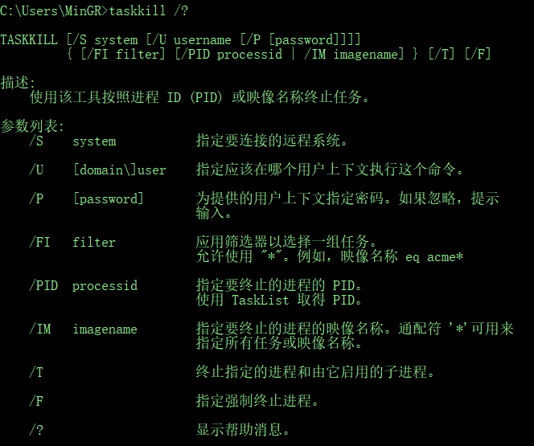

# 前言
在 **Windows** 系统下指令集有许多种，通常笔者在知道某一个指令集的时候第一个问题就是想知道这个指令集有哪些参数。

百度？谷歌？太慢！太累！

# 查看指令集参数
现在，有个终止任务的指令 `taskkill`。而笔者在只知道这个指令的时候，想通过这个指令去杀死指定进程的话前提是要知道这个指令有哪些参数！

## 指令集参数帮助指令
获取指令集参数指令是 `-?` 或者 `/?`

比如，笔者想获取 `taskkill` 指令有哪些参数，直接在 CMD 命令终端中输入 `taskkill -?` 或者 `taskkill /?`，如图所示：



现在就能一目了然的知道该指令集的参数了，参数都知道了再想杀死进程还不简单？


```
# 杀死 PID 为 1088 的进程
taskkill /PID 1088
```

现在，就能成功杀死指定进程了~
